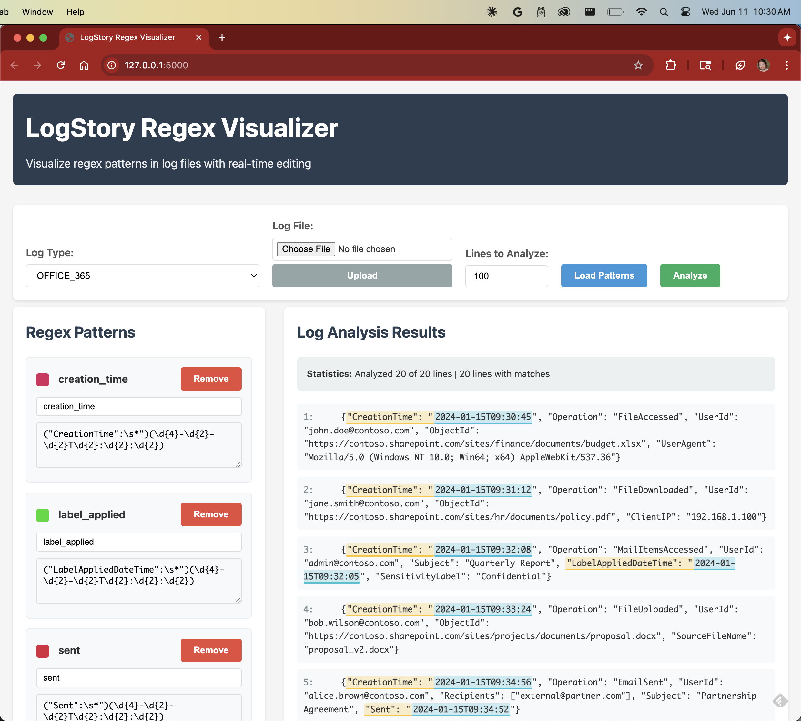

# LogStory Regex Visualizer

A web application for visualizing regex pattern matches in log files with real-time editing and color-coded highlighting.



## Features

- Load regex patterns from YAML configuration
- Real-time pattern editing with validation
- Color-coded visualization of regex matches
- Separate colors for capture groups
- WebSocket support for responsive updates
- Support for multiple log types

## Installation

1. Install Python dependencies:
```bash
pip install -r requirements.txt
```

## Usage

1. Start the Flask application:
```bash
python app.py
```

2. Open your browser and navigate to `http://localhost:5000`

3. Select a log type (e.g., OFFICE_365)

4. Click "Load Patterns" to load regex patterns from the YAML configuration

5. Edit patterns or add new ones

6. Click "Analyze" to visualize matches in the log file

## How it works

- Each regex pattern is assigned a unique color based on its name
- Full pattern matches are highlighted with a semi-transparent background
- Capture groups within each match are highlighted with modified colors
- Hover over highlighted text to see if it's a full match or capture group
- The legend shows all active patterns with their colors

## Configuration

Regex patterns are stored in `logtypes_events_timestamps.yaml`. Each log type contains a list of timestamp patterns with:
- `name`: Pattern identifier
- `pattern`: Regular expression pattern
- `group`: Which capture group contains the timestamp
- `dateformat` or `epoch`: Time format information

### Important: Avoid Duplicate Timestamp Matches

When creating patterns, ensure that **no two patterns match the same timestamp text**. This prevents:
- Overlapping visual highlights that confuse users
- Performance issues from redundant processing
- Incorrect timestamp analysis results

**Example Problem:**
```yaml
# BAD - These patterns will both match "UtcTime" in "CreationUtcTime"
- pattern: '("?UtcTime"?\s*:\s*"?)(\d{4}-\d{2}-\d{2} \d{2}:\d{2}:\d{2})'
- pattern: '("?CreationUtcTime"?\s*:\s*"?)(\d{4}-\d{2}-\d{2} \d{2}:\d{2}:\d{2})'

# GOOD - Word boundary prevents substring matching
- pattern: '(\b"?UtcTime"?\s*:\s*"?)(\d{4}-\d{2}-\d{2} \d{2}:\d{2}:\d{2})'
- pattern: '("?CreationUtcTime"?\s*:\s*"?)(\d{4}-\d{2}-\d{2} \d{2}:\d{2}:\d{2})'
```

Order patterns from most specific to least specific for best results.

## Claude Code Integration

This project includes custom Claude Code commands (in `.claude/commands/`) for enhanced development workflow:

### `/test-patterns` - Validate Regex Patterns

Test regex patterns against sample log data to catch issues early:

```
/test-patterns OFFICE_365
```

**Example Output:**
```
Testing Updated OFFICE_365 Patterns Against Log File
============================================================
Log file has 20 lines

Testing pattern: creation_time
Regex: ("CreationTime":")(\d{4}-\d{2}-\d{2}T\d{2}:\d{2}:\d{2})
  Total matches: 0
  ⚠️  No matches found - pattern may need adjustment

Testing pattern: label_applied  
Regex: ("LabelAppliedDateTime":\s*")(\d{4}-\d{2}-\d{2}T\d{2}:\d{2}:\d{2})
  Line 3: Found "2024-01-15T09:32:05"
  Line 8: Found "2024-01-15T09:37:25" 
  Line 16: Found "2024-01-15T09:45:35"
  Total matches: 3

Issue Found: The creation_time pattern expects "CreationTime":" but 
the log file contains "CreationTime": " (with space after colon).

Fix Needed: Change pattern to:
pattern: '("CreationTime":\s*")(\d{4}-\d{2}-\d{2}T\d{2}:\d{2}:\d{2})'

This uses \s* to match optional whitespace after the colon.
```

This immediately identifies pattern mismatches and suggests fixes before deployment.

### Other Available Commands:
- `/add-log-type [name]` - Add support for new log formats
- `/analyze-logs [file]` - Analyze unknown log files for timestamp patterns  
- `/run-demo` - Guided walkthrough of the application
- `/debug-patterns [type] [pattern]` - Debug specific regex pattern issues